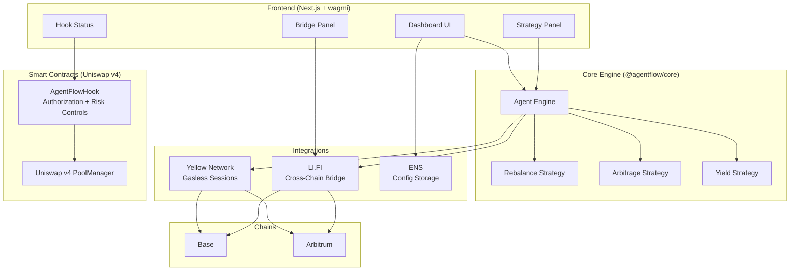

# AgentFlow DeFi

[](https://ethglobal.com/events/hackmoney2026)
[](https://soliditylang.org/)
[](https://nextjs.org/)
[](https://typescriptlang.org/)
[](LICENSE)

**Autonomous AI-powered cross-chain DeFi agent platform** that intelligently manages trading strategies, executes cross-chain rebalancing, and optimizes capital allocation across Base and Arbitrum.

## Architecture



## Features

- **Multi-Chain Dashboard** — Real-time portfolio view across Base and Arbitrum with token balances
- **AI Strategy Engine** — Pluggable strategy system (rebalance, arbitrage, yield) with confidence scoring
- **Uniswap v4 Hook** — On-chain authorization and risk controls via `beforeSwap`/`afterSwap` hooks
- **Yellow Network Sessions** — Gasless off-chain trading via state channels (save ~$0.50/trade)
- **Cross-Chain Bridging** — LI.FI-powered bridge routing between Base and Arbitrum
- **ENS Configuration** — Decentralized agent config stored in ENS text records
- **Risk Management** — Max swap size limits, daily volume caps, and slippage controls
- **Privacy Protection** — Batch tracking per block to obscure individual agent intent

## Deployed Contracts

| Chain | Contract | Address | Explorer |
|-------|----------|---------|----------|
| Base Sepolia | AgentFlowHook | `0x6d8d177010eA33c8A83246A5546C5C6bab5e8e41` | [View on Basescan](https://sepolia.basescan.org/address/0x6d8d177010eA33c8A83246A5546C5C6bab5e8e41) |

## Tech Stack

| Layer | Technology |
|-------|-----------|
| Frontend | Next.js 14, React 18, Tailwind CSS, RainbowKit, wagmi |
| Core Engine | TypeScript, Zod validation, pluggable strategy pattern |
| Smart Contracts | Solidity 0.8.26, Foundry, Uniswap v4 hooks |
| Integrations | Yellow Network SDK, LI.FI SDK, ENS (viem) |
| Package Management | pnpm workspaces monorepo |

## Project Structure

```
agentflow-defi/
├── apps/
│   └── web/                    # Next.js frontend dashboard
│       └── src/
│           ├── app/            # Next.js app router
│           ├── components/     # React components
│           │   ├── WalletConnect.tsx
│           │   ├── ChainBalances.tsx
│           │   ├── SessionPanel.tsx
│           │   ├── StrategyPanel.tsx
│           │   ├── BridgePanel.tsx
│           │   ├── HookStatus.tsx
│           │   ├── ENSConfig.tsx
│           │   └── ActivityLog.tsx
│           ├── contracts/      # ABI + deployed addresses
│           └── lib/            # wagmi config
├── packages/
│   ├── core/                   # Agent engine + strategies
│   │   └── src/
│   │       ├── engine.ts       # Central orchestration
│   │       ├── executor.ts     # Decision routing
│   │       ├── types.ts        # Shared types
│   │       └── strategies/     # Rebalance, Arbitrage, Yield
│   └── integrations/
│       ├── ens/                # ENS config loader
│       ├── lifi/               # LI.FI bridge router
│       └── yellow/             # Yellow Network sessions
├── contracts/                  # Solidity smart contracts
│   ├── src/
│   │   ├── AgentFlowHook.sol           # Uniswap v4 hook
│   │   └── AgentFlowHookDeployable.sol # Testnet-deployable version
│   ├── test/                   # Foundry tests
│   └── script/                 # Deployment scripts
└── docs/                       # Documentation
```

## Quick Start

### Prerequisites

- Node.js >= 18
- pnpm >= 9
- Foundry (for contracts)

### Install & Run

```bash
# Install dependencies
pnpm install

# Run frontend dev server
pnpm dev

# Build all packages
pnpm build
```

### Smart Contracts

```bash
cd contracts

# Install Foundry dependencies
forge install

# Run tests
forge test

# Deploy to Base Sepolia
source ../.env
forge script script/DeploySimple.s.sol:DeploySimple \
  --rpc-url https://sepolia.base.org --broadcast
```

## Sponsor Bounty Alignment

| Sponsor | Integration | How It's Used |
|---------|------------|---------------|
| **Yellow Network** | State channel sessions | Gasless off-chain trading — execute 100+ micro-swaps per session with zero gas |
| **Uniswap v4** | Custom hook (`AgentFlowHook`) | `beforeSwap` authorization + risk limits, `afterSwap` batch tracking for privacy |
| **LI.FI** | Bridge routing SDK | Cross-chain USDC bridging between Base and Arbitrum via Stargate |
| **ENS** | Text record config | Agent strategies stored as JSON in `agentflow.strategy` ENS text records |

## Documentation

- [Architecture](docs/architecture.md) — System design and component details
- [Contracts](contracts/README.md) — Smart contract documentation and deployment guide
- [Submission](docs/submission.md) — HackMoney submission descriptions
- [PRD](docs/prd.md) — Original product requirements document

## License

MIT
